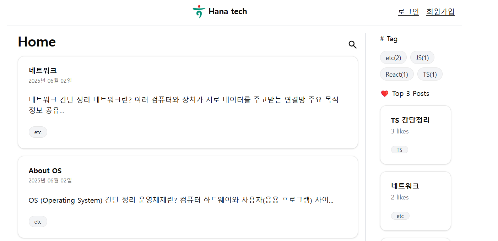
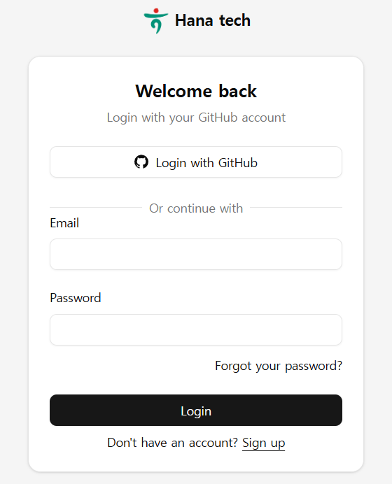
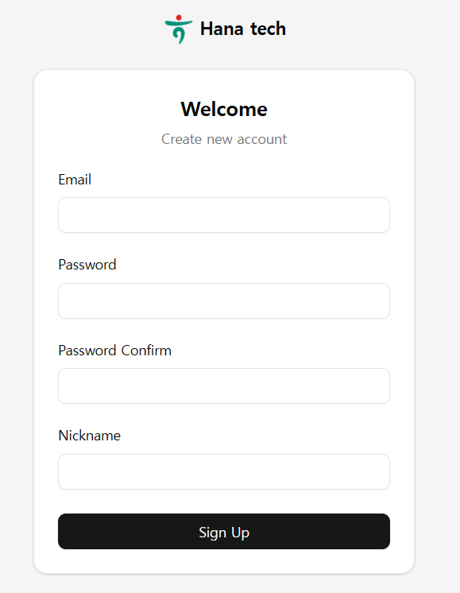
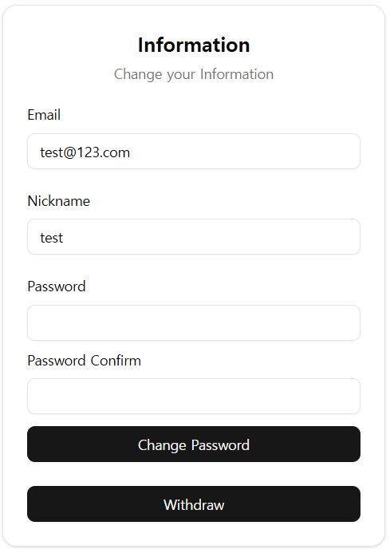
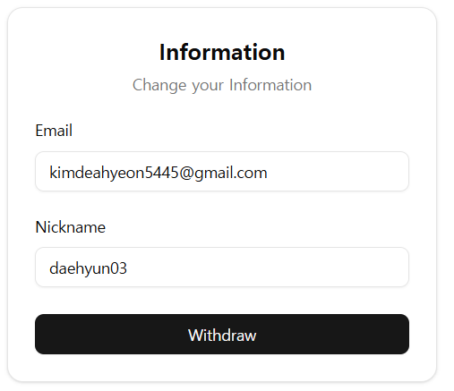

# Hana Tech Blog

This is a [Next.js](https://nextjs.org) project bootstrapped with [`create-next-app`](https://nextjs.org/docs/app/api-reference/cli/create-next-app).
## Getting Started
```bash
yarn install
yarn prismagen
yarn dev
```
Open [http://localhost:3000](http://localhost:3000) with your browser to see the result.

## Features

### User Authentication
| SignIn                       | SignUp                       |
|------------------------------|------------------------------|
|  |  |
- Sign up
- Sign in
- Sign out
- Password change
- Github OAuth
- User profile information
### User Profile
| User Profile                 | GitHub User Profile                    |
|------------------------------|----------------------------------------|
| |  |
- View user profile with nickname, email
- if you want to change the password, you can do it in the user-profile page. 
  - But you can't change if you are signed in with GitHub OAuth
- if you want to withdraw, you can do it in the user-profile page
### Post
#### Create Post
- Create a new post with title, content, and tag
- if you want to add a tag, you can add it on the post-creation page
#### Edit Post
- Edit an existing post and add a modified date
#### Delete Post
- Delete an existing post
#### View Post
- View a post with title, content, tag, written date and like & dislike count
- if you want to like or dislike a post, you can do it in the post-view page
- if exists modified date, it will be shown in the post-view page


